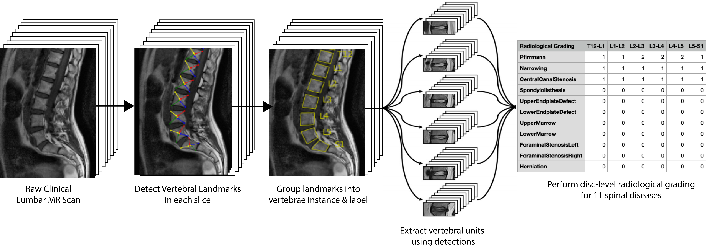

<p align="center">
 
</p>

**DISCLAIMER: SpineNet is not a diagnostics tool nor a medical device. It should only be used for research.**

## Introduction

SpineNet is automated software for analysing clinical spinal MRI scans. Current functionality includes:

1. Detecting and labelling vertebral bodies in sagittally-sliced MRI scan across a range of common sequences (e.g. T1, T2, STIR etc.) and fields of view (lumbar, cervical, whole spine).
2. Performing radiological grading at each intervertebral disc level in T2 lumbar scans from T12/L1 to L5/S1 for a range of common degenerative changes.

As well as using SpineNet for detecting and labelling vertebral bodies and the existing radiological gradings, you can also use the codebase for finetuning the model to perform additional gradings. For example, we have previously adapted it to detect vertebral fractures, cauda equina, ankylosing spondylitis and other diseases.

Please note that by using SpineNet you agree to our [terms of access](LICENCE.md). Amongst other things, this prohibits the use of SpineNet for commercial purposes. If you wish to acquire a more permissive licence of SpineNet, please contact us.


<p align="center">
 
</p>

## Getting Started

SpineNet's documentation is available [here](https://spinenet.readthedocs.io/en/latest)
### Install enviroments
A minimal python environment for running SpineNet can be found in `requirements.txt` and can be installed used

```
$ python -m venv spinenet-venv
$ source spinenet-venv/bin/activate
$ pip install -r requirements.txt
```

### Running The Code

Clone the repository and add the root directory to your PYTHONPATH, e.g. via
```
$ export PYTHONPATH=$PYTHONPATH:/path/to/SpineNet
```

When using SpineNet for the first time, you first must download weights from the VGG public server, by calling the function

```
spinenet.download_weights(verbose=True)
```

or to re-download them:

```
spinenet.download_weights(verbose=True,force=True)
```

For a guide on using SpineNet, see the `01-quickstart.ipynb` tutorial notebook.

## Citation

If you use SpineNet in your research, please cite our technical report, which can be found on arxiv [here](https://arxiv.org/abs/2205.01683)

"SpineNetV2: Automated Detection, Labelling and Radiological Grading Of Clinical MR Scans" (2022), Rhydian Windsor, Amir Jamaludin, Timor Kadir, Andrew Zisserman, *Technical Report*


You may also wish to cite our other works in this area:

"A Convolutional Approach to Vertebrae Detection and Labelling in Whole Spine MRI" (2020), Rhydian Windsor, Amir Jamaludin, Timor Kadir, Andrew Zisserman, *Medical Image Computing and Computer Aided Intervention (MICCAI) 2020*. [Springer](https://link.springer.com/chapter/10.1007/978-3-030-59725-2_69), [ArXiv](https://arxiv.org/abs/2007.02606)

"Context-Aware Transformers For Spinal Cancer Detection and Radiological Grading" (2022), Rhydian Windsor, Amir Jamaludin, Timor Kadir, Andrew Zisserman,
*Medical Image Computing and Computer Aided Intervention (MICCAI) 2022*. [ArXiv](https://arxiv.org/abs/2206.13173)

"SpineNet: Automated classification and evidence visualization in spinal MRIs" (2017), Amir Jamaludin, Timor Kadir, Andrew Zisserman, *Medical Image Analysis 41, p 63-73*.

"ISSLS PRIZE IN BIOENGINEERING SCIENCE 2017: Automation of reading of radiological features from magnetic resonance images (MRIs) of the lumbar spine without human intervention is comparable with an expert radiologist", (2017) Amir Jamaludin, Meelis Lootus, Timor Kadir, Andrew Zisserman, Jill Urban, Michele C. Battié, Jeremy Fairbank, Iain McCall & The Genodisc Consortium, *European Spine Journal 26, p 1374–1383*

## Example Scan Attribution

We are grateful to the providers of the example scans used in the tutorials (originally from [radiopedia.org](radiopedia.org)).
- 't2_lumbar_scan_1': [Case Contributed by Assoc Prof Frank Gaillard](https://radiopaedia.org/cases/normal-lumbar-spine-mri?lang=gb)
- 't2_lumbar_scan_2': [Case Contributed by Dr Henry Knipe](https://radiopaedia.org/cases/schmorl-node-acute-10?lang=gb)
- 'stir_whole_spine': [Case contributed by Dr Ian Bickle](https://radiopaedia.org/cases/normal-mri-whole-spine-3-t?lang=gb)

## Coming Soon

- [x] Documentation
- [ ] Pip installation
- [ ] In-depth tutorials on finetuning SpineNet's grading network

We are always looking to extend SpineNet to make it a more useful tool. If you have a request for features please get in touch with us.
